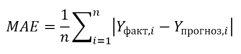

# Dream Mix WeatherApp

## Instruction to run a project with Docker
Before deploying the project, you need to configure the .env file, the project has .env .example
```
WEATHER_APP_ID=
SECRET_KEY_DJANGO=
```

After configuring the file, use Docker and docker-compose.

For a quick start, use:
```dockerfile
docker-compose up -d --build
```

By this url you can achive the site http://127.0.0.1:3000/

# Аналіз прогнозу


Для оцінки точності прогнозу метеорологічних даних обчислимо абсолютну помилку (Mean Absolute Error, MAE) 
між фактичними та прогнозованими значеннями температури. Формула MAE виглядає наступним чином:



де:

  - n - кількість спостережень,
  - Yфакт,i - фактична температура для i-го спостереження,
  - Yпрогноз,i - прогнозована температура для i-го спостереження.

Давайте обчислимо MAE для поданих даних:

```
Для 03:00:00:
∣2.3−2.12∣=0.18

Для 06:00:00:
∣1.5−0.67∣=0.83

Для 09:00:00:
∣1.13−(−0.14)∣=1.27

Для 12:00:00:
∣1.01−0.32∣=0.69

Для 15:00:00:
∣4.34−2.76∣=1.58

Для 18:00:00:
∣8.45−6.43∣=2.02
```

Тепер обчислимо середню абсолютну помилку (MAE):


Середня абсолютна помилка становить приблизно 1.12 градуса Цельсія. Це значення вказує на те, наскільки у 
середньому прогнозовані температури відрізняються від фактичних. Прогноз можна оцінити досить точним